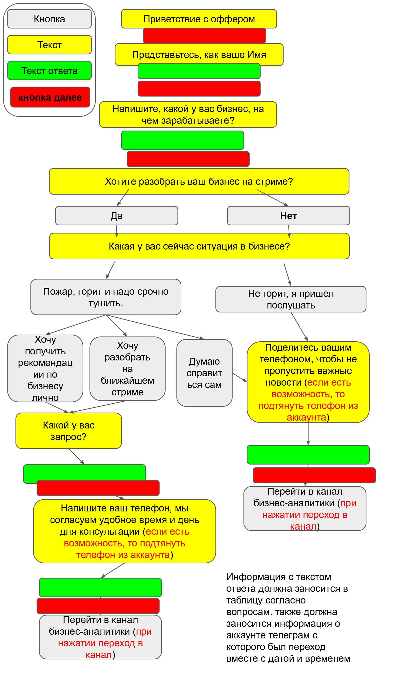
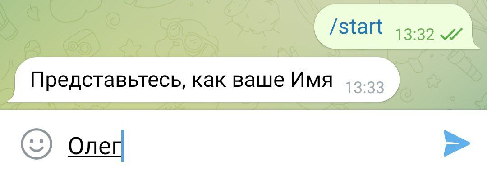
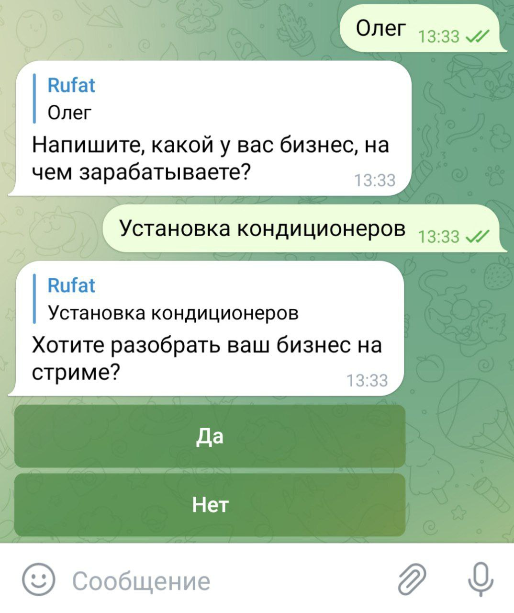
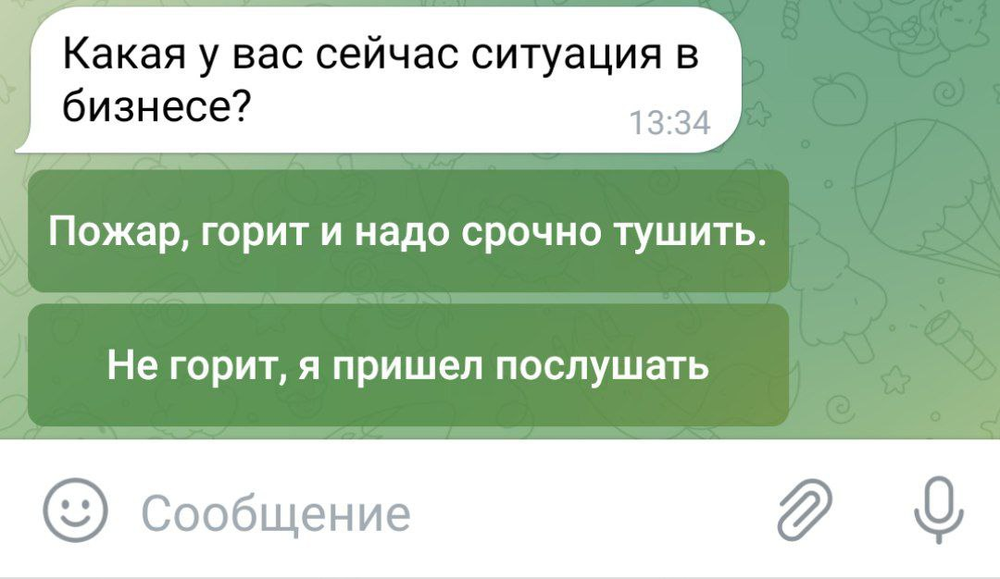
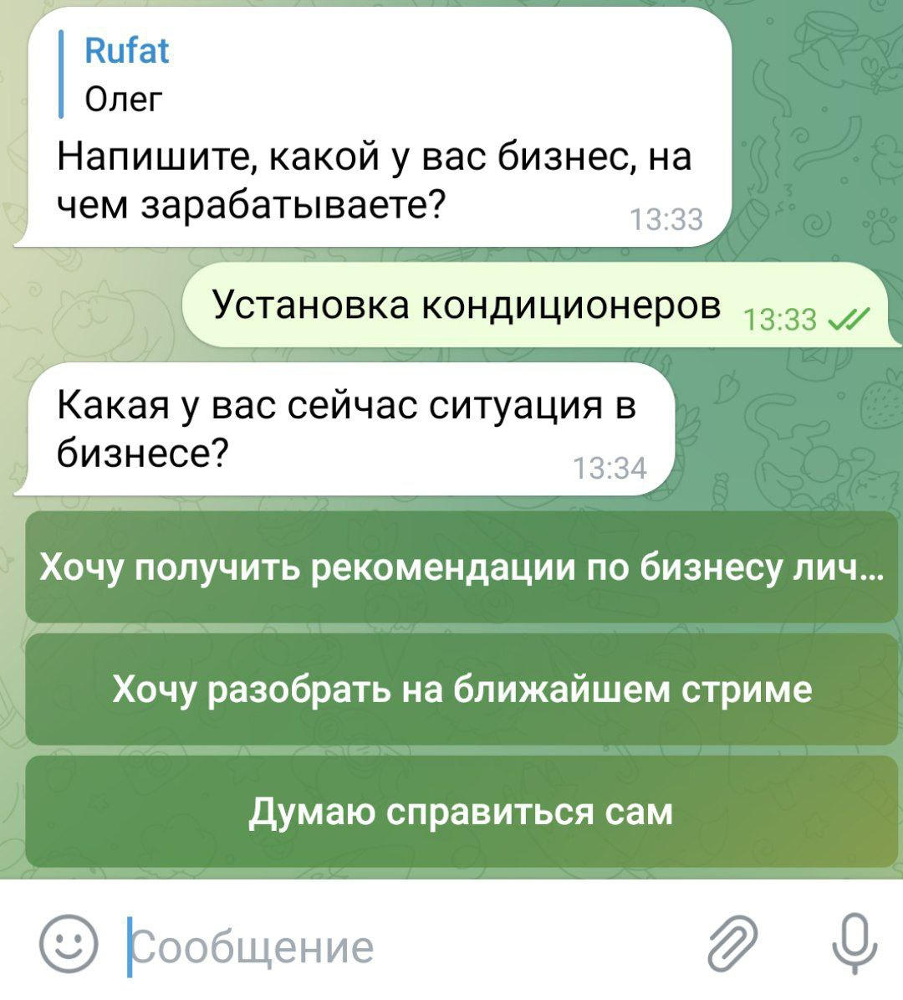
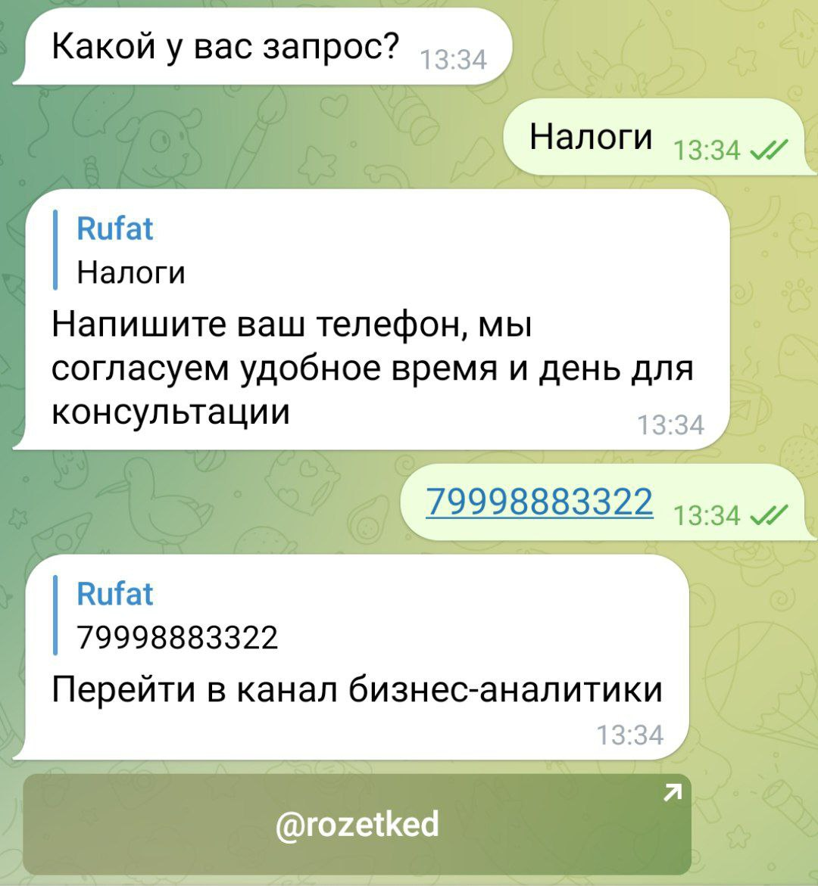
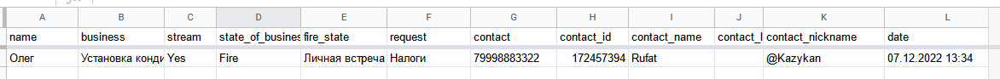

# Business bot

[](https://img.shields.io/badge/python-3.11-green) [](https://img.shields.io/badge/aiogram-2.23.1-green) [](https://img.shields.io/badge/gspread-5.7.2-green)

[](https://www.codewars.com/users/Kazykan/badges/small)


# Задание:
Сделать телеграмм бота с сохранением ответов в google sheets



# Реализация






Запись в google sheets


# Для работы
Нужен файл service_account.json поместить в корень проекта получить его можно на сайте https://console.developers.google.com/project
```sh
{
  "type": "service_account",
  "project_id": "",
  "private_key_id": "b",
  "private_key": "-----BEGIN PRIVATE",
  "client_id": "",
  "auth_uri": "https://accounts.google.com/o/oauth2/auth",
  "token_uri": "https://oauth2.googleapis.com/token",
  "auth_provider_x509_cert_url": "",
  "client_x509_cert_url": ""
}


```
Так же нужно создать файл config.py
```sh
TELEGRAM_TOKEN = 'Добавить свой токен'
```
